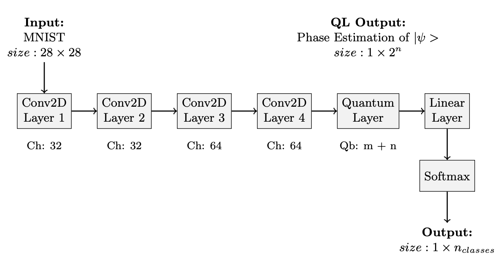

# QML Project
Taking inspiration from the article:  

MORE: Measurement and Correlation Based Variational Quantum Circuit for Multi-classification - Jindi Wu, Tianjie Hu, Qun Li  
https://arxiv.org/abs/2307.11875  

in this repository, a classifier (MNIST) with a quantum layer will be built.

## Code organization
<details>
  <summary>📂 QML_Project/</summary>
  
  - `checkpoints/` contains the model I trained
  - `configs/` includes  `train_configs.yaml`  used to train the quantum neural network
  - `imgs/` includes all the confusion matrices (CF) collected for the different tasks:
    * `0-1/` CF for the classifier trained to distinguish between digits 0 and 1.
    * `0-3/` CF for the classifier trained to distinguish between digits 0, 1, 2, 3.
    * `0-5/` CF for the classifier trained to distinguish between digits 0, 1, 2, 3, 4, 5.
    * `0-7/` CF for the classifier trained to distinguish between digits 0, 1, 2, 3, 4, 5, 6, 7.
  - `models/` includes the module `hybridNN.py` where you can find the NN definition
  - `my_custom_ai/` includes my personal custom training function divided in:
    * `custom_train/`
    * `utils/`
    * `instructions.txt`
  - `utils/` includes the modules:
    * `dataset_utils.py`
    * `main_utils.py`
  - `main.py`
</details>

## Hybrid Neural Network
The network consists of four convolutional layers, followed by a quantum layer and a linear layer, as illustrated in the figure.
<div>
  
</div>

For further details, refer to the file: `QML_Relation.pdf`

## Experiment
To install run:
```bash
pip install -r requirements.txt
```
To retrain the model and display the confusion matrices (before and after training), run:
```bash
python3  main.py --config configs/train_configs.yaml
```
`train_configs.yaml` contains all the settings you can configure for training.  

***NOTE***: by default, `device='cpu'`. For faster execution, replace it with your preferred device.  

Experiment results are available in: `QML_Relation.pdf`


